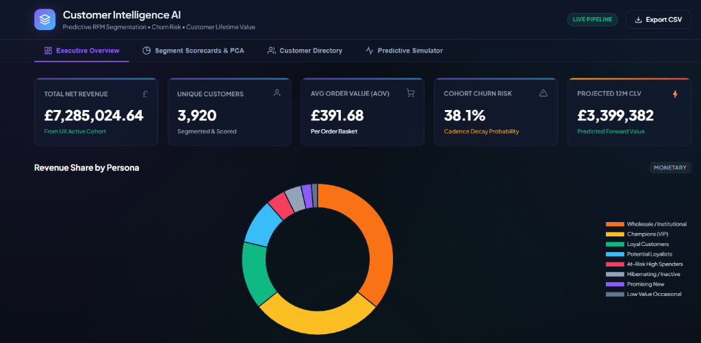
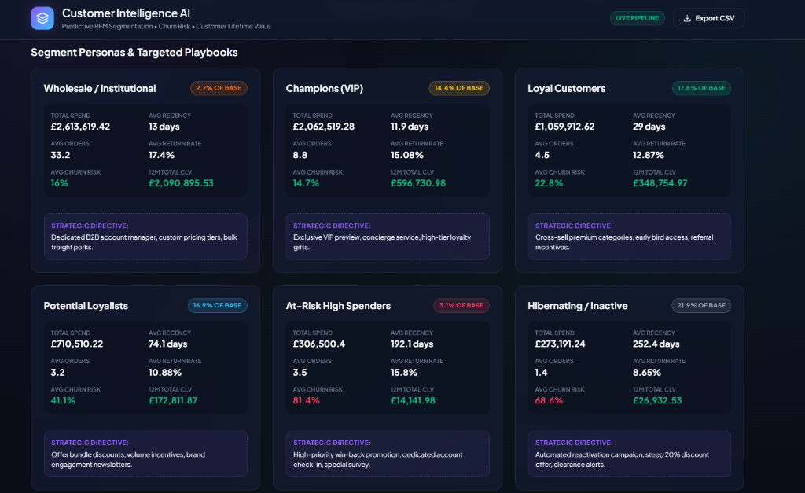
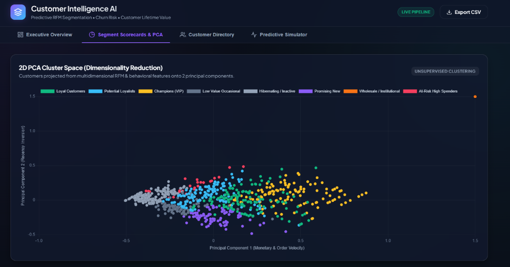
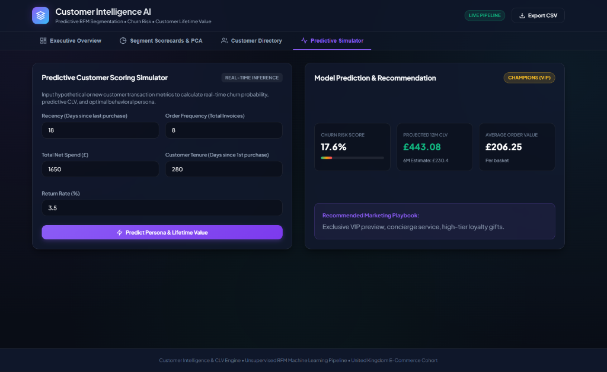

# Customer Intelligence & Predictive CLV Engine 


An end-to-end e-commerce customer intelligence and predictive segmentation system built on the [Online Retail dataset](https://archive.ics.uci.edu/ml/datasets/Online+Retail) (UCI Machine Learning Repository).

This project goes beyond baseline RFM analysis by providing **feature enrichment** (Return Rates, Average Order Value, Customer Tenure, Product Diversity, Purchase Cadence), **unsupervised machine learning clustering** (K-Means & 2D PCA projection), **predictive analytics** (Cadence-decay Churn Risk Probability & 12-Month Projected Customer Lifetime Value), and a **production-ready interactive executive dashboard with real-time scenario simulation**.

---

## Dashboard Visual Showcase

### 1. Executive Overview & Revenue Concentration
High-level commercial KPIs, revenue share donuts by persona, and forward-looking financial portfolio yields.


### 2. Segment Personas & Targeted Playbooks
Deep-dive scorecards for all 8 behavioral customer personas with commercial metrics (AOV, Recency, Churn Risk, 12M CLV) and targeted marketing directives.


### 3. 2D PCA Cluster Space (Dimensionality Reduction)
Interactive 2D Principal Component Analysis (PCA) projection capturing >80% of customer variance across multi-dimensional RFM feature space.


### 4. Predictive Customer Scoring Simulator
Real-time "What-If" scenario simulator allowing commercial teams to test customer recency, order cadence, spend, and return rate to forecast churn risk and 12-month CLV on the fly.


---

## Key Highlights & Architecture

- **Automated Data Pipeline (`scripts/pipeline.py`)**:
  - Automatically acquires, caches, and extracts the UCI dataset.
  - Cleans 540K+ transactions, segregating returns/cancellations to compute an explicit **Customer Return Rate (%)**.
  - Computes rich behavioral features: Recency ($R$), Frequency ($F$), Monetary spend ($M$), Average Order Value ($AOV$), Product Diversity, Return Rate ($%$), Customer Tenure, and Average Days between Orders (Purchase Cadence).
  - Outlier isolation: Identifies high-volume B2B wholesale buyers using an IQR filter to preserve retail cluster geometry, re-integrating them as a dedicated commercial tier.
  - Log transformations (`log1p`), inverse recency scaling, and K-Means clustering ($k=4$).
  - 2D Principal Component Analysis (PCA) for visual cluster separation.
  - Predictive non-contractual churn probability ($0-100\%$) via Sigmoid cadence decay and forward-looking 6M & 12M CLV estimations at 25% net profit margin.

- **8 Behavioral Segment Personas**:
  | Persona | Customer Share | Revenue Share | Avg Recency | Avg AOV | Churn Risk | Strategic Business Directive |
  | :--- | :---: | :---: | :---: | :---: | :---: | :--- |
  | **🏢 Wholesale / Institutional** | 2.7% | **35.9%** | 13.0 days | £2,203 | 16.0% | Dedicated B2B account manager, custom pricing tiers, bulk freight perks. |
  | **👑 Champions (VIP)** | 14.4% | **28.3%** | 11.9 days | £466 | 14.7% | Exclusive VIP preview, concierge service, high-tier loyalty gifts. |
  | **💎 Loyal Customers** | 17.8% | 14.5% | 29.0 days | £381 | 22.8% | Cross-sell premium categories, early bird access, referral incentives. |
  | **🚀 Potential Loyalists** | 16.9% | 9.8% | 74.1 days | £394 | 41.1% | Offer bundle discounts, volume incentives, brand engagement newsletters. |
  | **⚠️ At-Risk High Spenders** | 3.1% | 4.2% | 192.1 days | £917 | **81.4%** | High-priority win-back promotion, dedicated account check-in, special survey. |
  | **🧊 Hibernating / Inactive** | 21.9% | 3.8% | 252.4 days | £243 | 68.6% | Automated reactivation campaign, steep 20% discount offer, ad-spend suppression. |
  | **🌱 Promising New** | 12.8% | 2.2% | 22.5 days | £234 | 22.1% | Welcome discount on 2nd purchase, onboarding email journey, product tips. |
  | **🛍️ Low Value Occasional** | 10.5% | 1.3% | 80.0 days | £189 | 39.6% | Target with low-barrier impulse buys and seasonal holiday campaigns. |

- **Interactive Executive Dashboard (`dashboard/` & `server.py`)**:
  - **Executive Overview**: High-level KPIs, revenue share donuts, and CLV financial yield charts.
  - **Segment Scorecards & PCA Space**: Interactive 2D PCA scatter plot and segment playbooks.
  - **Customer Directory**: Searchable, filterable table of all 3,920 customers with sorting, pagination, and a deep-dive profile modal.
  - **Predictive Simulator**: What-if customer scenario tool predicting churn risk & CLV in real time.
  - **CRM Export**: One-click targeted campaign CSV export for marketing automation.

---

## Quick Start

### 1. Requirements
Ensure Python 3.8+ is installed with the following packages:
```bash
pip install pandas numpy scikit-learn matplotlib seaborn openpyxl
```

### 2. Run the Feature Engineering & ML Pipeline
```bash
python scripts/pipeline.py
```
*This downloads the dataset, computes all enriched metrics, trains the models, and generates `data/customers_enriched.csv` and `data/customers_summary.json`.*

### 3. Launch the Interactive Dashboard
```bash
python server.py
```
Open your browser and navigate to:
```
http://localhost:8000
```

---

## Project Structure

```
Customer_Segmentation-main/
├── customer-segmentation.ipynb      # Initial exploratory research notebook
├── scripts/
│   └── pipeline.py                  # Automated data enrichment & ML pipeline
├── data/
│   ├── online_retail.zip            # Cached raw dataset
│   ├── Online Retail.csv            # Extracted transactions
│   ├── customers_enriched.csv       # Scored customer intelligence dataset
│   └── customers_summary.json       # Executive KPIs and PCA coordinates
├── dashboard/
│   ├── index.html                   # Modern executive dashboard UI
│   ├── styles.css                   # Custom dark-theme design system
│   └── app.js                       # Chart.js visualizations & interactivity
├── assets/
│   └── screenshots/                 # Dashboard UI captures
│       ├── executive_overview.png
│       ├── segment_playbooks.png
│       ├── pca_clusters.png
│       └── predictive_simulator.png
├── server.py                        # Lightweight API & UI server
└── README.md                        # Documentation
```
